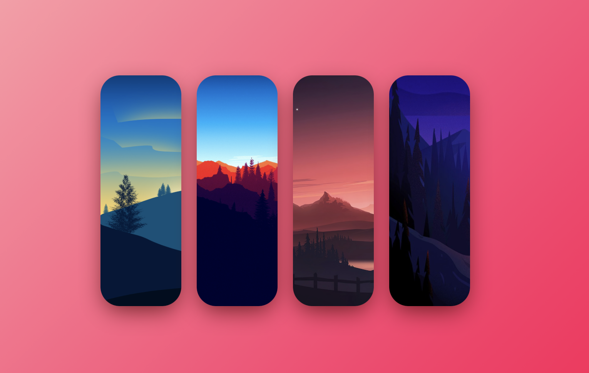
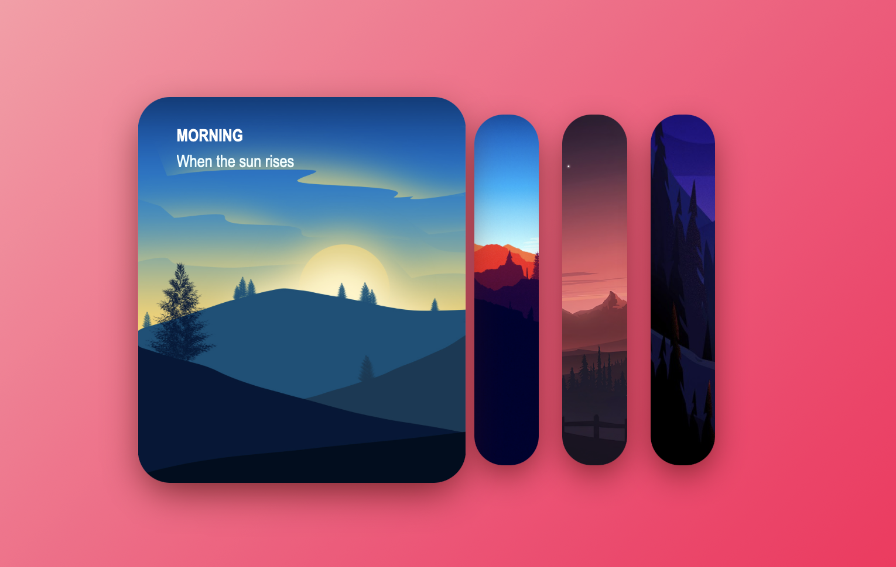
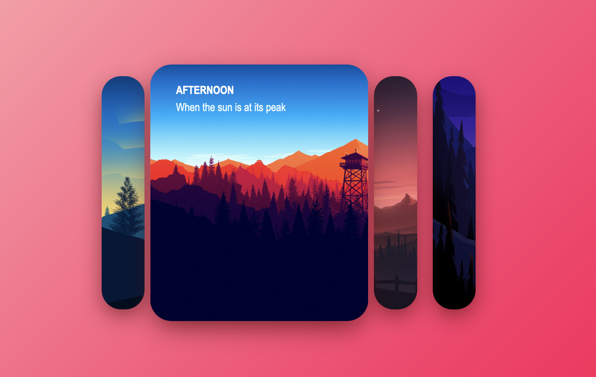
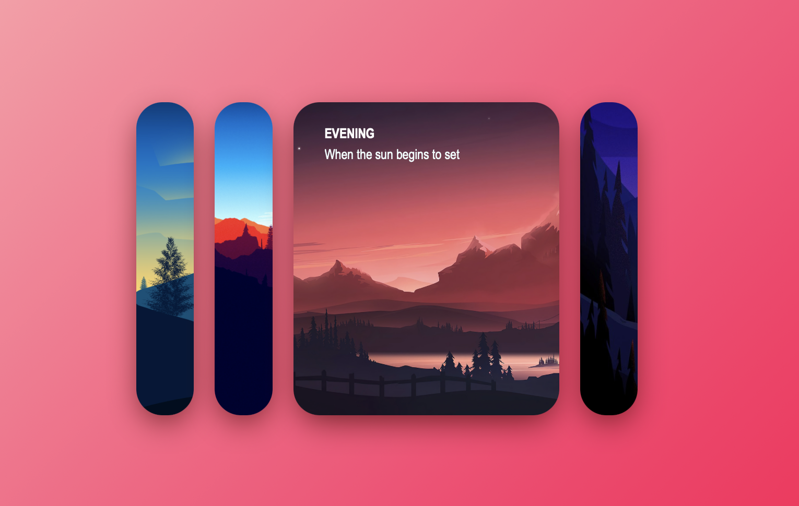

# Image Accordion
Este proyecto es un **Image Accordion** interactivo, donde puedes hacer clic en las imágenes para expandirlas y ver más detalles sobre cada imagen. Utiliza HTML, CSS y JavaScript para crear una experiencia visual dinámica y atractiva.

## Descripción
El proyecto consiste en una serie de tarjetas con imágenes y descripciones. Cada tarjeta tiene un título y una pequeña descripción. Al hacer clic en una tarjeta, se expande, mostrando más detalles y cambiando el tamaño de la imagen.

## 🚀 Demo en Vivo  
🔗 [Ver Proyecto en Vercel](https://image-accordion-neon.vercel.app)  

## Características
- **Interactividad**: El usuario puede hacer clic en las tarjetas para expandirlas y ver más información.
- **Animaciones**: Se utiliza CSS para animar las tarjetas, haciendo que se agranden cuando el usuario pasa el ratón sobre ellas.
- **Diseño responsivo**: El diseño se adapta para funcionar bien en diferentes tamaños de pantalla.

## 🛠️ Tecnologías Usadas  
- **HTML5** 🏗️  Para la estructura de las tarjetas y la disposición del contenido.
- **CSS3** 🎨  Para los estilos y la animación de las tarjetas.

## 📸 Vista Previa  

